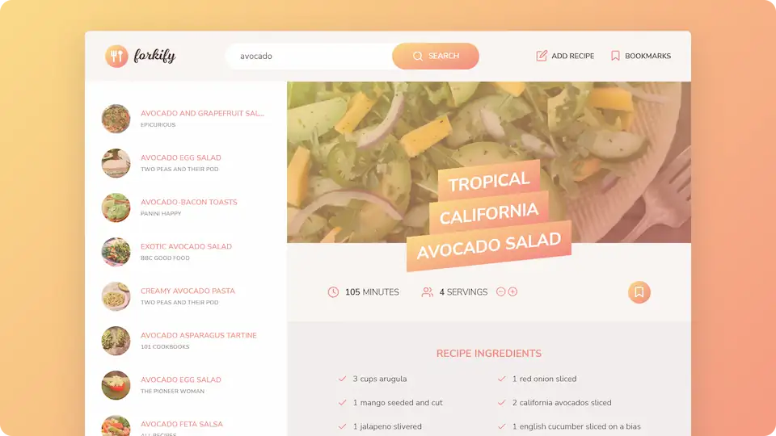

# <picture><source media="(prefers-color-scheme: dark)" srcset="forkify-logo-light.webp"><source media="(prefers-color-scheme: light)" srcset="forkify-logo.webp"></picture>

**Search for recipes, bookmark them, or upload your own.**

## 💻 Screenshot

## 🛠️ Tools and technologies
`JavaScript` `HTML` `Sass` `Fetch API` `Fracty` `Parcel`

In the project I used:

- Model-view-controller architecture
- Object-oriented programming as well as functional programming paradigms
- Publisher-subscriber design pattern to solve event handling problem
- AJAX calls with [Forkify API v2](https://forkify-api.herokuapp.com/v2 'Forkify API v2')
- [Fracty](https://npm.io/package/fracty 'Fracty Docs') NPM library to convert decimal numbers to fractions
- [Parcel](https://parceljs.org/ 'Parcel') NPM build tool for development and production
- [Node.js](https://nodejs.org/en/ 'Node.js') as a JS development environment
- [Git](https://git-scm.com/ 'Git') for version control

## 🌐 Deployment
Deployed on `Netlify`.

Live preview at [dawidlehai-forkify.netlify.app](https://dawidlehai-forkify.netlify.app/).

## ℹ️ Instructions
Try searching for examples for `pizza`, `avocado` or `cheese`. Then click on the recipe to display it. You can add recipes to bookmarks, change servings count and even add your own recipes!

## 🎓 Related course
This project was created as a part of the [Udemy](https://www.udemy.com/ 'Udemy') course [_The Complete JavaScript Course 2022: From Zero to Expert!_](https://www.udemy.com/course/the-complete-javascript-course/ 'See this course on Udemy') by [Jonas Schmedtmann](https://twitter.com/jonasschmedtman 'Jonas Schmedtmann on Twitter').
